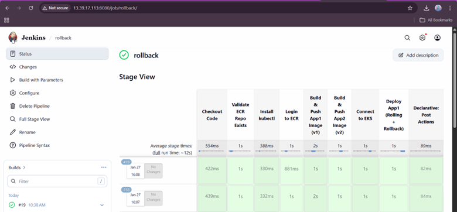
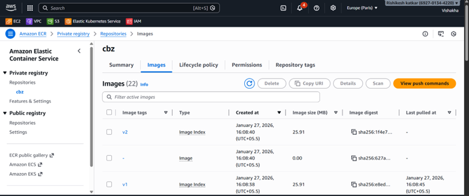
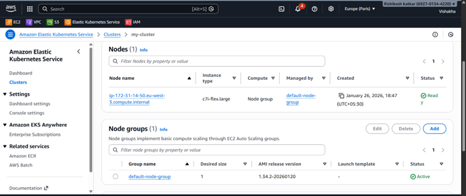
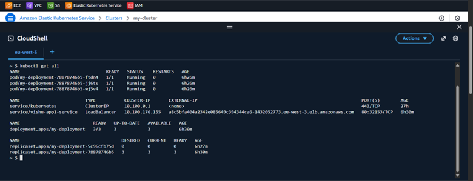
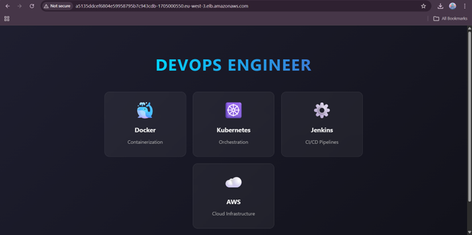
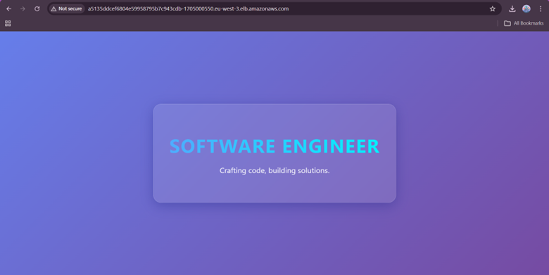

🚀 Executive Project Overview – CI/CD on AWS EKS  
📌 Project Title

**End-to-End CI/CD Pipeline using Jenkins, Docker, Amazon ECR, and AWS EKS**

🎯 Objective

Design and implement a production-grade CI/CD pipeline that automatically builds, scans, pushes, and deploys a containerized frontend application to AWS Elastic Kubernetes Service (EKS) using Jenkins.

**This setup supports:**

Automated builds from GitHub

Docker image creation & push to Amazon ECR

Kubernetes deployment on EKS using jenkinsfile

Zero‑downtime rolling updates

Fast rollback using Kubernetes

External access via AWS LoadBalancer

🧩 High‑Level Architecture (EKS‑Specific)  
Developer  
│  
▼  
GitHub Repository  
│ ( Poll SCM)  
▼

Create a cluster using jenkinsfile

│  
▼  
Jenkins (EC2 / VM)  
│  
├── Build Docker Image  
├── Push Image to Amazon ECR  
└── Deploy to AWS EKS  
│  
▼  
Kubernetes Cluster (EKS)  
│  
├── Deployment (RollingUpdate)  
└── Service (LoadBalancer)  
│  
▼  
End Users (LoadBalancer )

  
**🔁** **CI/CD Flow Explanation (Clear & Step‑by‑Step)**

**Code Commit  
**Developer pushes code (HTML + Dockerfile) to GitHub.

**Jenkins Trigger**  
Jenkins pipeline is triggered automatically.

**Build Stage**  
Jenkins builds a Docker image from the Dockerfile.

**Create Cluster**                                                                                                                                   
Using Jenkinsfile  Create a Cluster  

**Push to Amazon ECR**  
Jenkins authenticates with AWS and pushes the image to ECR.

**Deploy to AWS EKS**  
Jenkins applies Kubernetes YAML files using kubectl.

**Service Exposure**  
Application is exposed using a Kubernetes LoadBalancer.

**Rolling Update**  
New pods are created gradually without downtime.

**🔄** **Rollout & Rollback Strategy (With LoadBalancer)****✅ Rolling Update**

Managed by a Kubernetes Deployment strategy

Old pods stay alive until new pods are healthy

LoadBalancer routes traffic only to healthy pods

**⏪ Rollback**

If deployment fails:

kubectl rollout undo deployment my-deployment

**Benefits:**

Instant rollback

No image rebuild needed

Zero downtime

📂 Repository Structure  
.  
├── index.html

├── deployment.yaml

├── service-app1.yaml  
├── Dockerfile  
├── Jenkinsfile  
└── app2/  
├── deployment-app2.yaml  
└── service-app2.yaml

├── Dockerfile  
├── Jenkinsfile

  
🧪**Jenkinsfile**
jenkinsfile

[Link to jenkinsfile](./jenkinsfile)

**☸️** **Kubernetes Deployment YAML (Full – Verbatim)**apiVersion: apps/v1
deployment.yaml
[Link to first image](./deployment.yaml)

[Link to first image](./service-app1.yaml)

**☸️** **Kubernetes Deployment YAML (Full – Verbatim)**apiVersion: apps/v2
deployment.yaml
[Link to second image](./app2/deployment-app2.yaml)

[Link to first image](./app2/service-app2.yaml)

  
🖼️ **Screenshots Section (Add in Repo)**

Add screenshots under /screenshots folder:

**Jenkins Pipeline Success**

**Amazon ECR Image**

**EKS Nodes & Pods**

**LoadBalancer External IP**

**Application Output in Browser**

**V2 image output in Browser**

**Rollback Output in Browser**

 

**🧾** **Important AWS & Kubernetes Commands**  
**ECR Repository Creation**

aws ecr create-repository --repository-name my-cluster --region eu-west-3

**Update Kubeconfig**  
aws eks update-kubeconfig --region eu-west-3 --name  my-cluster

  
**Verify Pods & Services**

kubectl get pods  
kubectl get svc  
Rollback Deployment  
kubectl rollout undo deployment my-deployment

**🏁 Final Outcome**

✔ Fully automated CI/CD pipeline  
✔ Production‑ready EKS deployment  
✔ Secure image storage in ECR  
✔ Zero‑downtime rollout & instant rollback  
✔ Scalable and cloud‑native architecture

